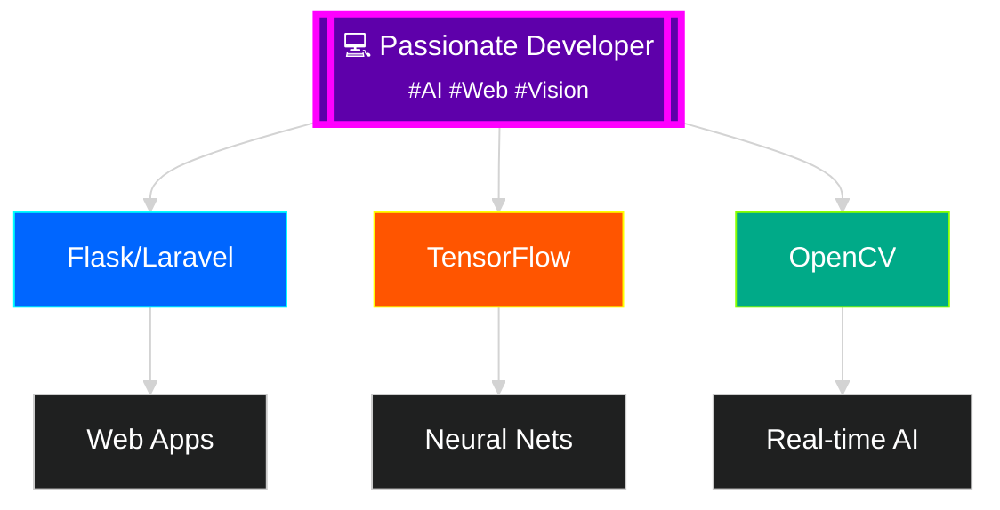

<!-- Animated Gradient Header with Contrast Text -->

<!-- High-Contrast Typing Animation -->

<!-- Floating Developer GIF -->

---

## 🎨 About Me

<!-- High-Contrast Tech Badges Grid -->
<table>
  <tr>
    <td align="center" width="120">
      
       Python
    </td>
    <td align="center" width="120">
      
       TensorFlow
    </td>
    <td align="center" width="120">
      
       Flask
    </td>
    <td align="center" width="120">
      
       Laravel
    </td>
  </tr>
  <tr>
    <td align="center" width="120">
      
       OpenCV
    </td>
    <td align="center" width="120">
      
       MediaPipe
    </td>
    <td align="center" width="120">
      
       Git
    </td>
    <td align="center" width="120">
      
       JS
    </td>
  </tr>
</table>

<!-- Glowing Stats Cards -->

<!-- Animated Graph -->

<!-- Contrast Streak Stats -->

<!-- Snake Animation - Using a working alternative until the GitHub Action generates the file -->

  <h3 style="color:#00ffff; text-align:center; margin-bottom:15px;">🐍 GitHub Contribution Snake</h3>
  
Loading contribution animation...

  
The snake animation will appear here once the GitHub Action runs

<!-- Alternative Snake Animation using a different service -->

<!-- Project Cards with Glow Effect -->
<table>
  <tr>
    <td width="50%">
      <h3 align="center" style="color:#00ffff; text-shadow: 0 0 8px #00ffff">Object Detection System</h3>
      

        
        
Real-time detection using YOLO and Flask

        

          
🚀 AI-Powered Detection

        

      

    </td>
    <td width="50%">
      <h3 align="center" style="color:#ff00ff; text-shadow: 0 0 8px #ff00ff">AI Web Dashboard</h3>
      

        
        
Interactive dashboard with live predictions

        

          
📊 Real-time Analytics

        

      

    </td>
  </tr>
</table>

<!-- Glowing Social Buttons -->

<!-- Floating Animation -->

<!-- Gradient Footer -->

