<!-- Animated Gradient Header with Contrast Text -->

<!-- High-Contrast Typing Animation -->

<!-- Floating Developer GIF -->

---

## 🎨 About Me

```mermaid
%%{init: {'theme':'dark', 'themeVariables': {
  'primaryColor': '#2a0a4a',
  'edgeLabelBackground':'#1a1a2e',
  'tertiaryColor': '#ff00ff',
  'textColor': '#ffffff'
}}}%%
graph TD
    A[["💻 Passionate Developer<br><font size=2>#AI #Web #Vision</font>"]] --> B[Flask/Laravel]
    A --> C[TensorFlow]
    A --> D[OpenCV]
    B --> E[Web Apps]
    C --> F[Neural Nets]
    D --> G[Real-time AI]
    style A fill:#5e00aa,stroke:#ff00ff,stroke-width:4px,color:#ffffff
    style B fill:#0066ff,stroke:#00ffff
    style C fill:#ff5500,stroke:#ffff00
    style D fill:#00aa88,stroke:#88ff00
```

<!-- High-Contrast Tech Badges Grid -->
<table>
  <tr>
    <td align="center" width="120">
      
       Python
    </td>
    <td align="center" width="120">
      
       TensorFlow
    </td>
    <td align="center" width="120">
      
       Flask
    </td>
    <td align="center" width="120">
      
       Laravel
    </td>
  </tr>
  <tr>
    <td align="center" width="120">
      
       OpenCV
    </td>
    <td align="center" width="120">
      
       MediaPipe
    </td>
    <td align="center" width="120">
      
       Git
    </td>
    <td align="center" width="120">
      
       JS
    </td>
  </tr>
</table>

<!-- Glowing Stats Cards -->

<!-- Animated Graph -->

<!-- Contrast Streak Stats -->

<!-- Animated Skills Progress Bars -->

  <h3 style="color:#00ffff; text-align:center; margin-bottom:20px; text-shadow: 0 0 10px #00ffff;">🚀 Skills Progress</h3>
  
  

    

      Python & AI/ML
      90%
    

    

      

    

  

  
  

    

      Web Development
      85%
    

    

      

    

  

  
  

    

      Computer Vision
      80%
    

    

      

    

  

<!-- Animated Achievement Cards -->

  

    <h4 style="color:#00ffff; margin-bottom:10px;">🏆 10+ Projects</h4>
    
Successfully delivered web and AI solutions

  

  
  

    <h4 style="color:#ff00ff; margin-bottom:10px;">🤖 AI/ML Expert</h4>
    
Specialized in computer vision and neural networks

  

  
  

    <h4 style="color:#ff5500; margin-bottom:10px;">🌐 Full-Stack</h4>
    
End-to-end web application development

  

<!-- Project Cards with Glow Effect -->
<table>
  <tr>
    <td width="50%">
      <h3 align="center" style="color:#00ffff; text-shadow: 0 0 8px #00ffff">Object Detection System</h3>
      

        
        
Real-time detection using YOLO and Flask

        

          
🚀 AI-Powered Detection

        

      

    </td>
    <td width="50%">
      <h3 align="center" style="color:#ff00ff; text-shadow: 0 0 8px #ff00ff">AI Web Dashboard</h3>
      

        
        
Interactive dashboard with live predictions

        

          
📊 Real-time Analytics

        

      

    </td>
  </tr>
</table>

<!-- Animated Contact Section -->

  

  

    <h3 style="color:#00ffff; text-align:center; margin-bottom:25px; text-shadow: 0 0 15px #00ffff; font-size:24px;">🌟 Let's Connect & Collaborate!</h3>
    
    

      <a href="mailto:asadrammy9594@gmail.com" style="text-decoration:none;">
        

          📧 Gmail
        

      </a>
      
      <a href="https://www.linkedin.com/in/asad-rammy-5494a9342" style="text-decoration:none;">
        

          💼 LinkedIn
        

      </a>
      
      <a href="https://github.com/Asadrammy" style="text-decoration:none;">
        

          🐙 GitHub
        

      </a>
    

    
    
Ready to build amazing AI-powered solutions together! 🚀

  

<!-- Animated Current Work Section -->

  <h3 style="color:#ff00ff; text-align:center; margin-bottom:25px; text-shadow: 0 0 15px #ff00ff; font-size:24px;">🔥 Currently Working On</h3>
  
  

    

      <h4 style="color:#00ffff; margin-bottom:10px;">🤖 Advanced AI Models</h4>
      
Developing sophisticated machine learning models for computer vision and natural language processing using TensorFlow and PyTorch.

    

    
    

      <h4 style="color:#ff00ff; margin-bottom:10px;">🌐 Full-Stack Web Apps</h4>
      
Building scalable web applications with modern frameworks, integrating AI capabilities for enhanced user experiences.

    

    
    

      <h4 style="color:#ff5500; margin-bottom:10px;">👁️ Computer Vision</h4>
      
Creating real-time object detection and image processing systems using OpenCV and MediaPipe for various applications.

    

  

<!-- Animated Fun Facts -->

  <h3 style="color:#ff5500; text-align:center; margin-bottom:25px; text-shadow: 0 0 15px #ff5500; font-size:24px;">💡 Fun Facts About Me</h3>
  
  

    

      
🎮

      
Gaming enthusiast who finds inspiration in game design and user experience

    

    
    

      
☕

      
Coffee-powered developer who codes best during late-night sessions

    

    
    

      
📚

      
Always learning new technologies and staying updated with AI trends

    

    
    

      
🌍

      
Passionate about creating technology that makes a positive impact

    

  

<!-- Animated Footer Section -->

  <h3 style="color:#00ffff; margin-bottom:20px; text-shadow: 0 0 15px #00ffff; font-size:28px;">🚀 Ready to Build Something Amazing?</h3>
  
  

    I'm always excited to collaborate on innovative projects, especially those involving AI, machine learning, and cutting-edge web technologies. 
    Let's turn your ideas into reality! 💡✨
  

  
  

    🤖 AI/ML Projects
    🌠Web Development
    👁️ Computer Vision
  

  
  

    
  

<!-- Profile Views Counter -->

  

<!-- Final Animated Footer -->

  
  
  

    <strong>Thanks for visiting my profile!</strong> 🌟 
    Feel free to explore my repositories and connect with me. 
    Let's build something amazing together! 💻 🚀
  

