# 👋 Hi there, I'm Asad Rammy!

<!-- Animated Gradient Header with Contrast Text -->

<!-- High-Contrast Typing Animation -->

<!-- Floating Developer GIF -->

---

## 🎨 About Me

```mermaid
%%{init: {'theme':'dark', 'themeVariables': {
  'primaryColor': '#2a0a4a',
  'edgeLabelBackground':'#1a1a2e',
  'tertiaryColor': '#ff00ff',
  'textColor': '#ffffff'
}}}%%
graph TD
    A[["💻 Passionate Developer<br><font size=2>#AI #Web #Vision</font>"]] --> B[Flask/Laravel]
    A --> C[TensorFlow]
    A --> D[OpenCV]
    B --> E[Web Apps]
    C --> F[Neural Nets]
    D --> G[Real-time AI]
    style A fill:#5e00aa,stroke:#ff00ff,stroke-width:4px,color:#ffffff
    style B fill:#0066ff,stroke:#00ffff
    style C fill:#ff5500,stroke:#ffff00
    style D fill:#00aa88,stroke:#88ff00
```

<!-- High-Contrast Tech Badges Grid -->
<table>
  <tr>
    <td align="center" width="120">
      
       Python
    </td>
    <td align="center" width="120">
      
       TensorFlow
    </td>
    <td align="center" width="120">
      
       Flask
    </td>
    <td align="center" width="120">
      
       Laravel
    </td>
  </tr>
  <tr>
    <td align="center" width="120">
      
       OpenCV
    </td>
    <td align="center" width="120">
      
       MediaPipe
    </td>
    <td align="center" width="120">
      
       Git
    </td>
    <td align="center" width="120">
      
       JS
    </td>
  </tr>
</table>

<!-- Glowing Stats Cards -->

<!-- Animated Graph -->

<!-- Contrast Streak Stats -->

<!-- Skills Progress Section -->
## 🚀 Skills Progress

| Skill | Level |
|-------|-------|
| **Python & AI/ML** | ⭐⭐⭐⭐⭐ |
| **Web Development** | ⭐⭐⭐⭐ |
| **Computer Vision** | ⭐⭐⭐⭐ |
| **Database Management** | ⭐⭐⭐⭐ |
| **Git & Version Control** | ⭐⭐⭐⭐⭐ |

<!-- Achievement Cards -->
## 🏆 Achievements

| 🏆 **10+ Projects** | 🤖 **AI/ML Expert** | 🌐 **Full-Stack** |
|---------------------|---------------------|-------------------|
| Successfully delivered web and AI solutions | Specialized in computer vision and neural networks | End-to-end web application development |

<!-- Project Cards with Glow Effect -->
<table>
  <tr>
    <td width="50%">
      <h3 align="center">🤖 Object Detection System</h3>
      

        Real-time detection using YOLO and Flask
      

      

        <strong>Tech Stack:</strong> Python, TensorFlow, OpenCV, Flask
      

      

        🚀 **AI-Powered Detection**
      

    </td>
    <td width="50%">
      <h3 align="center">📊 AI Web Dashboard</h3>
      

        Interactive dashboard with live predictions
      

      

        <strong>Tech Stack:</strong> Python, Flask, JavaScript, TensorFlow
      

      

        📊 **Real-time Analytics**
      

    </td>
  </tr>
</table>

## 🌟 Currently Working On

- 🔧 **Advanced AI Models** - Developing sophisticated machine learning models for computer vision and natural language processing
- 🌐 **Full-Stack Web Apps** - Building scalable web applications with modern frameworks, integrating AI capabilities
- 👁️ **Computer Vision** - Creating real-time object detection and image processing systems using OpenCV and MediaPipe

## 💡 Fun Facts About Me

- 🎮 **Gaming Enthusiast** - I find inspiration in game design and user experience
- ☕ **Coffee-Powered Developer** - I code best during late-night sessions
- 📚 **Continuous Learner** - Always learning new technologies and staying updated with AI trends
- 🌍 **Impact-Driven** - Passionate about creating technology that makes a positive impact

## 📫 Let's Connect!

## 🚀 Ready to Build Something Amazing?

I'm always excited to collaborate on innovative projects, especially those involving AI, machine learning, and cutting-edge web technologies. Let's turn your ideas into reality! 💡✨

**Areas of Expertise:**
- 🤖 **AI/ML Projects** - Neural networks, computer vision, predictive analytics
- 🌐 **Web Development** - Full-stack applications, responsive design
- 👁️ **Computer Vision** - Real-time detection, image processing

---

<!-- Profile Views Counter -->

<!-- Final Animated Footer -->

### 🌈 Thanks for visiting my profile!

*Feel free to explore my repositories and connect with me. Let's build something amazing together!* 💻 🚀

